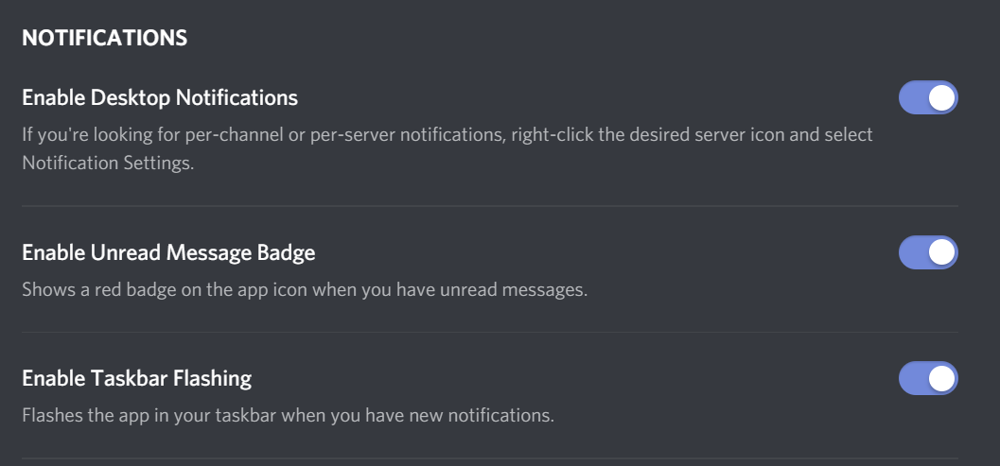
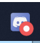
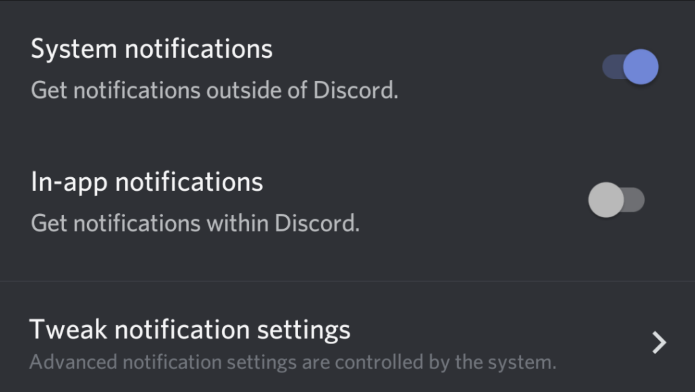
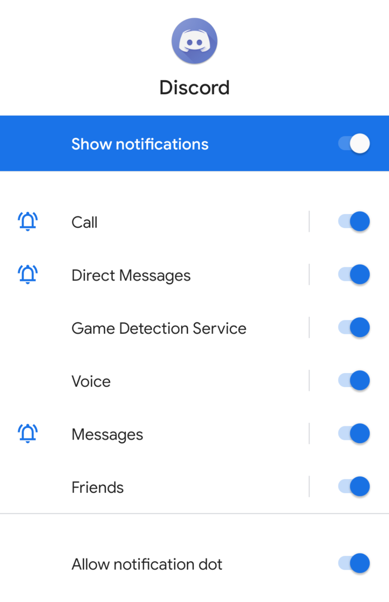

# Discord

[Discord](http://discordapp.com/) is a chat application for browser, desktop (through an embedded browser system), Android and iOS. It has a robust notification system which allows managing how you're alerted for all messages, @mentions, and @everyones for each individual channel on each individual server you're connected to. It also lets you have different notification settings for the mobile and desktop versions. Discord also optionally has email notifications.

The notification system crosses over with the muting system, which serves other purposes, such as hiding channels you're not interested in.

The official documentation on notifications is located [here](https://support.discordapp.com/hc/en-us/sections/201131308-Notifications).

This page is current as of Feb. 15, 2020; Desktop version: Stable 54611 (3fb9c49); Android version: 10.4.1 (1037) <!-- If the UI wasn't changed, feel free to just update the version without retaking any shots! Don't change filenames unless the shot was retaken. -->

## Global notification settings

### Desktop and Browser

To access your settings on the browser and desktop versions, you'll find a gear under the Friends/Channel list, to the right of your name.

Under the **App Settings** section, click **Notifications**. There are four sections we will discuss individually.

For desktop, you will see this:

  
|  |
| --- |
| Enable Desktop Notifications - If you're looking for per-channel or per-server notifications, right-click the desired server icon and select Notification Settings. |
| Enable Unread Message Badge - Shows a red badge on the app icon when you have unread messages. |
| Enable Taskbar Flashing - Flashes the app in your taskbar when you have new notifications. |

When "Enable Desktop Notifications" is disabled, all desktop popup notifications are prevented. These notifications use the browser/OS-level notification system, showing a preview of the message and who sent it. When it's enabled, Discord will rely on the more specific notification settings to decide whether or not to send a notification.

When "Enabled Unread Message Badge" is enabled, you will see this indicator when you have unread messages:

| System | Icon |
| --- |: --- :|
| Windows taskbar icon |  |
| Windows tray icon |  |
| Chrome browser tab |  |

If you have any @mentions, a number will appear in the red circle indicating how many, up to 9.

"Enabled Taskbar Flashing" does not appear in the browser version. In the desktop version, it controls whether or not the taskbar icon for discord flashes when there's a new message, regardless of whether or not a preview message appears through the notification system. For instance, if you enable this but disable "Enable Desktop Notifications", you will never see a popup notification for a message, but the taskbar icon will still flash.

TODO: other sections

### Mobile

To access your settings in the mobile version, first tap the three lines icon in the upper-left, and you'll find a gear under the Friends/Channel list, to the right of your name.

Under the **App Settings** section, tap **Notifications**.

For Android, you will see this:

  
|  |
| --- |
| System notifications - Get notifications outside of Discord. |
| In-app notifications - Get notifications within Discord. |
| Tweak notification settings - Advanced notification settings are controlled by the system. |

TODO: descriptions

Tapping "Tweak notification settings" takes you to the Android notifications settings for the Discord app. You can also get here by long pressing the icon on your home screen or app list and tapping **App info** then tapping **Notifications**. Here's what it looks like in Android 10:

|  |
| --- |
| Show notifications |
| Call |
| Direct Messages |
| Game Detection Service |
| Voice |
| Messages |
| Friends |
| Advanced -> Allow notification dot |

TODO: descriptions

## Server and Channel

TODO

### Muting

TODO

## Flowchart

TODO
