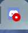
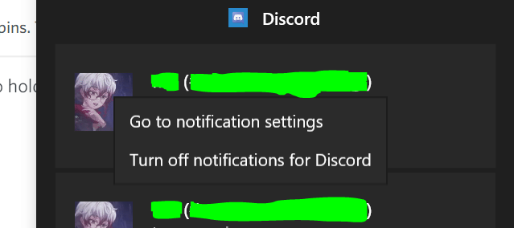
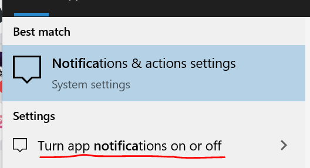
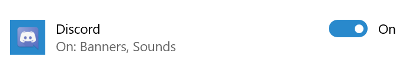
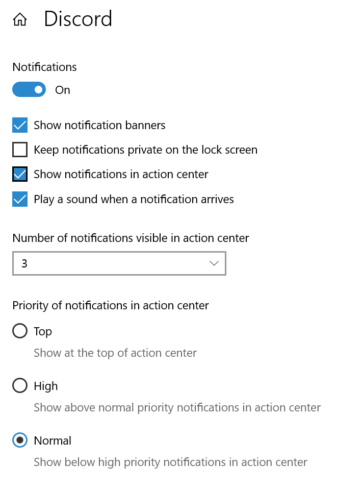

# Discord

[Discord](http://discordapp.com/) is a chat application for browser, desktop (through an embedded browser system), Android and iOS. It has a robust notification system which allows managing how you're alerted for all messages, @mentions, and @everyones for each individual channel on each individual server you're connected to. It also lets you have different notification settings for the mobile and desktop versions. Discord also optionally has email notifications.

The notification system crosses over with the muting system, which serves other purposes, such as hiding channels you're not interested in and hiding unread markers.

The official documentation on notifications is located [here](https://support.discordapp.com/hc/en-us/sections/201131308-Notifications).

This page is current as of Feb. 15, 2020; Desktop version: Stable 54611 (3fb9c49); Android version: 10.4.1 (1037) <!-- If the UI wasn't changed, feel free to just update the version without retaking any shots! Don't change filenames unless the shot was retaken. -->

## Global notification settings

### Desktop and Browser

To access your settings on the browser and desktop versions, you'll find a gear under the Friends/Channel list, to the right of your name.

Under the **App Settings** section, click **Notifications**. There are four sections we will discuss individually.

For desktop, you will see this:
  
|  |
| --- |
| Enable Desktop Notifications - If you're looking for per-channel or per-server notifications, right-click the desired server icon and select Notification Settings. |
| Enable Unread Message Badge - Shows a red badge on the app icon when you have unread messages. |
| Enable Taskbar Flashing - Flashes the app in your taskbar when you have new notifications. |

When "Enable Desktop Notifications" is disabled, all desktop popup notifications are prevented. These notifications use the browser/OS-level notification system, showing a preview of the message and who sent it. When it's enabled, Discord will rely on the more specific notification settings to decide whether or not to send a notification.

When "Enabled Unread Message Badge" is enabled, you will see this indicator when you have unread messages:

| System | Icon |
| --- | :-: |
| Windows taskbar icon |  |
| Windows tray icon |  |
| Chrome browser tab |  |

If you have any @mentions, a number will appear in the red circle indicating how many, up to 9.

"Enabled Taskbar Flashing" does not appear in the browser version. In the desktop version, it controls whether or not the taskbar icon for discord flashes when there's a new message, regardless of whether or not a preview message appears through the notification system. For instance, if you enable this but disable "Enable Desktop Notifications", you will never see a popup notification for a message, but the taskbar icon will still flash.

The next section, "Push Notification AFK Timeout" controls when notifications are sent to your mobile device, if you use Discord on your mobile device. (TODO: If you don't, does this option even appear?) There is no way to disable this behavior in order to always send push notifications to your mobile device despite using Discord on your desktop. You may only set it to be between 1 and 10 minutes (at 1 minute intervals). Nobody knows how this actually functions (TODO: figure it out).

"Text-to-Speech" notifications simply reads any would-be pop-up notifications to you. When this is set to "For current selected channel" it will read the channel even if its category is muted (but not if the channel itself is).

The last section, "Sounds", allows you to select which events should play a sound (however, what sound that is can't be altered.) All of these, except for **Message** are related to voice chatting. Note that PTT is Push-To-Talk.

TODO: images

#### Windows 10 notifications for desktop Discord

While you can disable desktop notifications globally within Discord (and the setting is even saved separately from the browser settings) you can also disable them at the Windows notification system level. This is likely never actually useful to do but if you ever need to _undo_ it this knowledge would be. Additionally, there are settings you can fine-tune here which could be useful.

The primary way to disable the notifications is to wait to receive one from Discord. Then, in the action center (button in the lower-right, near your date and time), right-click the message and select "Turn off notifications for Discord" 

In order to re-enable notifications later (or disable them in a more complex way), in the search bar, search for `notifications` and select "Turn app notifications on or off"  Under "Get notifications from these senders" (sorted alphabetically) there sould be an entry for Discord which you can toggle.  If you click the entry (not the toggle bar), you'll end up at a screen for more detailed control of these settings, seen below.

<div style="clear: both">
<div style="float: right"></div>

```none
Notifications
Toggler On/Off

☑ Show notification banners
☐ Keep notifications private on the lock screen
☑ Show notifications in action center
☑ Play a sound when a notification arrives

Number of notifications visible in the action cetner
3

Priority of notifications in action center
⚪ Top
  Show at the top of the action center
⚪ High
  Show above normal priority notifications in action center
🔘 Normal
  Show below high priority notifications in action center
```

</div>

Due to the sensitive nature of communication, we highly recommend enabling "Keep notifications private on the lock screen" if your notifications are enabled at this level.

"Show notification banners" refers to the pop-up itself. And if you have "Message" in the "Sounds" section disabled but are still hearing sounds, you can disable "Play a sound when a notification arrives"

The action center is the menu accessed from the button in the lower right of your screen, next to the date & time.

### Mobile

To access your settings in the mobile version, first tap the three lines icon in the upper-left, and you'll find a gear under the Friends/Channel list, to the right of your name.

Under the **App Settings** section, tap **Notifications**.

For Android, you will see this:
  
|  |
| --- |
| System notifications - Get notifications outside of Discord. |
| In-app notifications - Get notifications within Discord. |
| Tweak notification settings - Advanced notification settings are controlled by the system. |

TODO: descriptions

Tapping "Tweak notification settings" takes you to the Android notifications settings for the Discord app. You can also get here by long pressing the icon on your home screen or app list and tapping **App info** then tapping **Notifications**. Here's what it looks like in Android 10:

|  |
| --- |
| Show notifications |
| Call |
| Direct Messages |
| Game Detection Service |
| Voice |
| Messages |
| Friends |
| Advanced -> Allow notification dot |

TODO: descriptions

## Server and Channel

TODO

### Muting

TODO

## Flowchart

TODO
